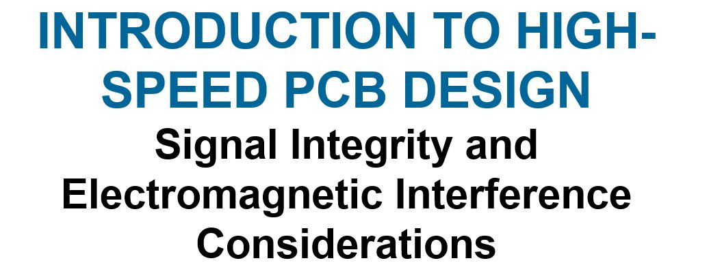

# LectureSlides_HighSpeedPCBDesign

      by F. Kung
      Faculty of Engineering
      Multimedia University
      63100 Cyberjaya, Malaysia

This repository is an archieve for slides and videos that were developed for a course entitled "High-speed PCB design" for engineers and postgraduate students during the period from 2004 to 2013.
There are some video files that accompany the slides from Part 1 to Part 3.  These are mostly in Microsoft's AVI format. 
- Part 1: Introduction to multi-layer printed circuit board (PCB) structures
- Part 2: Signal integrity (SI), electromagnetic interference (EMI) and electromagnetic compatibility (EMC)
- Part 3A: Transmission line and signal propagation I
- Part 3B: Transmission line and signal propagation II
- Part 4: PCB layout rules for signal integrity
- Part 5: Basic differential signalling
